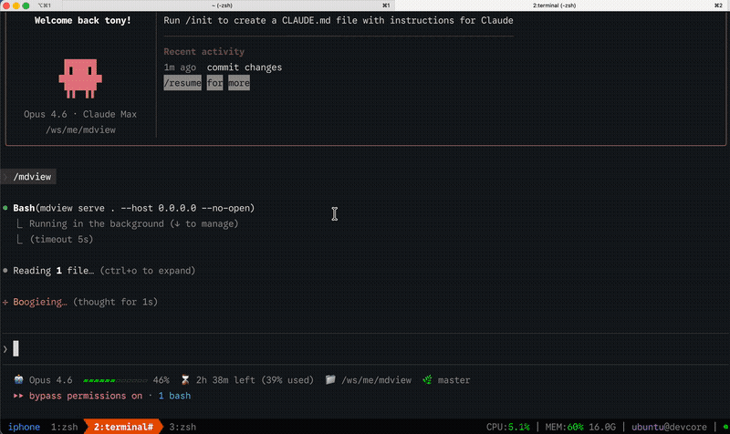

# mdview - Markdown Novel Viewer

A calm, book-like HTTP server for reading markdown files and code with distraction-free, elegant styling. Perfect for documentation, long-form content, and project plans.



## Quick Start

### Install

```bash
# Build from source (requires Go 1.22+)
git clone https://github.com/vntonyh/mdview.git
cd mdview && make install
```

### Start Viewing

```bash
# View a single file
mdview serve ~/my-document.md

# View a directory
mdview serve ~/my-docs/

# Custom port
mdview serve ~/docs --port 3000

# Open browser automatically
mdview serve ~/docs --open

# Bind to network address (be careful!)
mdview serve ~/docs --host 0.0.0.0

# Static mode — serve a folder as plain files (no rendering)
mdview static                # current directory
mdview static ~/site         # specific directory
```

Then open your browser to `http://localhost:3456`

### Stop the Server

```bash
mdview stop
```

## Features

### Markdown Rendering
- CommonMark-compliant parsing with Goldmark
- YAML/TOML frontmatter support
- Code block syntax highlighting (20+ languages)
- Mermaid diagram rendering
- Automatic table of contents
- Relative image path resolution

### Navigation
- **Plan-based sidebars** - Automatically detects `plan.md` with 6 format support:
  - Markdown tables
  - Heading-based phases
  - Bullet lists
  - Checkboxes
  - Mixed structures
- **Status badges** - Visual indicators for completed/in-progress/pending phases
- **Accordion navigation** - Organized phase groups with persistent collapse state
- **Previous/Next links** - Jump between pages
- **Breadcrumb trails** - Know where you are

### User Experience
- **Theme system** - Light/dark mode with smooth switching
  - Detects OS preference
  - Toggles instantly (no reload)
  - Persists across sessions
- **Font size control** - Three sizes (S/M/L) with localStorage persistence
- **Keyboard shortcuts** - Full navigation without mouse:
  - T: Toggle theme
  - S: Toggle sidebar
  - ←/→: Previous/next page
  - ?: Show shortcuts
  - Esc: Close modals
- **Responsive design** - Works on desktop, tablet, and mobile
- **Progress bar** - Visual scroll position indicator
- **Expandable content** - Full-viewport code blocks and diagrams

### Code Viewing
- 25+ languages with Chroma syntax highlighting and line numbers

### Directory Browsing
- File type icons, quick navigation, breadcrumbs

## CLI Reference

```bash
mdview serve <path> [flags]    # Render markdown/code; browse directories
mdview static [path] [flags]   # Plain static file server (no rendering); defaults to .
  -p, --port int               #   Port (default 3456)
  -H, --host string            #   Host (default 0.0.0.0)
  -o, --open                   #   Auto-open browser
  --no-open                    #   Don't open browser
  --public                     #   Shortcut for --host 0.0.0.0
  --foreground                 #   JSON output for Claude Code
mdview list                    # List running instances
mdview stop                    # Stop all instances
mdview version                 # Print version
```

## Architecture

mdview consists of three layers:

1. **CLI** - Cobra-based command-line interface
2. **Go Backend** - HTTP server with markdown rendering, plan parsing, and navigation
3. **Web Frontend** - Vanilla JavaScript with CSS custom properties for theming

All static assets (CSS, JavaScript) are embedded in the binary for single-file distribution.

**Full documentation:**
- [Architecture Overview](./docs/system-architecture.md)
- [Codebase Summary](./docs/codebase-summary.md)

## Building

```bash
make build          # Build for current platform
make install        # Build + install to ~/.local/bin/
make test           # Run tests
make build-all      # Cross-compile (linux/arm64, darwin/amd64+arm64, windows/amd64)
```

Requires Go 1.22+ and GNU Make.

## Documentation

| Document | Purpose |
|----------|---------|
| [Project Overview & PDR](./docs/project-overview-pdr.md) | Vision, requirements, scope |
| [System Architecture](./docs/system-architecture.md) | Component design, request flow, data flow |
| [Codebase Summary](./docs/codebase-summary.md) | Directory structure, LOC breakdown |
| [Code Standards](./docs/code-standards.md) | Go patterns, JS patterns, CSS patterns |
| [Design Guidelines](./docs/design-guidelines.md) | Colors, typography, layout, accessibility |
| [Project Roadmap](./docs/project-roadmap.md) | Versions, timeline, features, milestones |

## Keyboard Shortcuts

| Key | Action |
|-----|--------|
| T | Toggle theme | S | Toggle sidebar | ←/→ | Prev/next page | ? | Show shortcuts | Esc | Close modal |

## Plan Navigation

Place a `plan.md` in your docs directory with phases in table, heading, bullet, or checkbox format. mdview auto-detects it and builds sidebar navigation with status badges.

## Security

- Path validation with allowedDirs whitelist, `..` traversal blocked
- Default localhost binding, read-only file serving
- All assets embedded (no external dependencies at runtime)

## Tech Stack

Go 1.22 | Goldmark | Chroma v2 | Mermaid v11 | Vanilla JS + CSS

## License

MIT

---

**mdview** - Read markdown beautifully.
